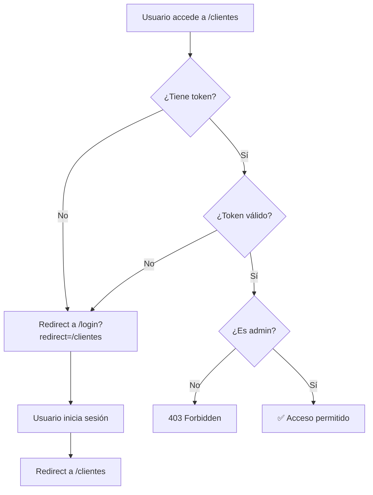

# 🛡️ Middleware de Autenticación

## 📋 Resumen

Este middleware protege tu aplicación validando la autenticación en **TODAS** las rutas, tanto del cliente como de las APIs.

## ✅ ¿Qué Protege?

### 🔒 Rutas API
- **Todas las rutas `/api/*`** excepto:
  - `/api/auth/verificar-admin`
  - `/api/auth/registrar-primer-admin`

### 🔒 Rutas de Página
- **Todas las rutas** excepto:
  - `/login`
  - `/registro`
  - `/` (home)
  - Archivos estáticos (imágenes, CSS, JS)

## 🔑 ¿Cómo Funciona?

1. **Extrae el token** de las cookies de Supabase
2. **Valida el token** llamando a la API de Supabase
3. **Verifica el rol** de administrador
4. **Bloquea o permite** el acceso según las reglas

## 📊 Códigos de Respuesta

| Código | Significado | Acción |
|--------|-------------|--------|
| 401 | No autenticado | Redirige a `/login` |
| 403 | Sin permisos | Bloquea (no es admin) |
| 500 | Error interno | Logs del error |

## 🎯 Casos de Uso

### Caso 1: Usuario sin autenticar intenta acceder a `/clientes`
```
Request: GET /clientes
Token: ❌ No existe
Acción: ➡️ Redirect a /login?redirect=/clientes
```

### Caso 2: Usuario autenticado accede a la API
```
Request: GET /api/clientes
Token: ✅ Válido
Rol: ✅ Admin
Acción: ✅ Permitir acceso
```

### Caso 3: Usuario con token expirado
```
Request: POST /api/asistencias
Token: ❌ Expirado
Acción: ⛔ 401 Unauthorized
```

### Caso 4: Usuario no-admin intenta acceder
```
Request: GET /api/clientes
Token: ✅ Válido
Rol: ❌ User (no admin)
Acción: ⛔ 403 Forbidden
```

## 🛠️ Helpers Disponibles

### `getSupabaseToken(request)`
Extrae el token de las cookies. Soporta múltiples formatos.

```typescript
import { getSupabaseToken } from '@/lib/auth';

const token = getSupabaseToken(request);
if (!token) {
  // Sin autenticar
}
```

### `validateSupabaseToken(token)`
Valida el token con la API de Supabase.

```typescript
import { validateSupabaseToken } from '@/lib/auth';

const { valid, user, error } = await validateSupabaseToken(token);
if (valid) {
  console.log('Usuario:', user);
}
```

### `isAdmin(user)`
Verifica si un usuario tiene rol de admin.

```typescript
import { isAdmin } from '@/lib/auth';

if (isAdmin(user)) {
  // Es administrador
}
```

## ⚙️ Configuración

### Variables de Entorno Requeridas
```env
NEXT_PUBLIC_SUPABASE_URL="https://tu-proyecto.supabase.co"
NEXT_PUBLIC_SUPABASE_ANON_KEY="tu-anon-key"
```

### Matcher Config
El middleware se ejecuta en todas las rutas excepto:
- `/_next/static/*` (archivos estáticos)
- `/_next/image/*` (optimización de imágenes)
- `/favicon.ico`
- Archivos de imagen (svg, png, jpg, etc.)

## 🔄 Flujo de Redirección



## 🚨 Troubleshooting

### Problema: "No autenticado" pero estoy logueado
**Causa**: El nombre de la cookie de Supabase no coincide.

**Solución**: Verifica en DevTools > Application > Cookies el nombre exacto y agrégalo en `lib/auth.ts`:
```typescript
const possibleCookieNames = [
  'sb-access-token',
  'supabase-auth-token',
  'tu-cookie-name-aqui', // Agregar aquí
];
```

### Problema: Loops infinitos de redirección
**Causa**: El middleware redirige a una ruta protegida.

**Solución**: Asegúrate que `/login` está en las rutas públicas:
```typescript
const isAuthRoute = request.nextUrl.pathname.startsWith('/login');
```

### Problema: APIs lentas después del middleware
**Causa**: Cada request valida el token con Supabase.

**Solución**: Implementar caché de tokens (próxima mejora).

## 📈 Mejoras Futuras

- [ ] Caché de tokens validados (Redis)
- [ ] Rate limiting por IP
- [ ] Logs estructurados (Sentry)
- [ ] Métricas de autenticación
- [ ] Soporte para refresh tokens

## 🔐 Seguridad

### ✅ Protecciones Implementadas
- Validación de token en servidor
- Verificación de rol de admin
- Mensajes de error informativos
- Redirección segura con query params

### ⚠️ Consideraciones
- Los tokens viajan en cookies (secure + httpOnly)
- Las rutas API públicas están limitadas
- Los errores se loggean pero no exponen detalles sensibles

## 📚 Referencias

- [Next.js Middleware](https://nextjs.org/docs/app/building-your-application/routing/middleware)
- [Supabase Auth](https://supabase.com/docs/guides/auth)
- [Security Best Practices](https://owasp.org/www-project-top-ten/)

---

*Última actualización: 11/11/2025*
